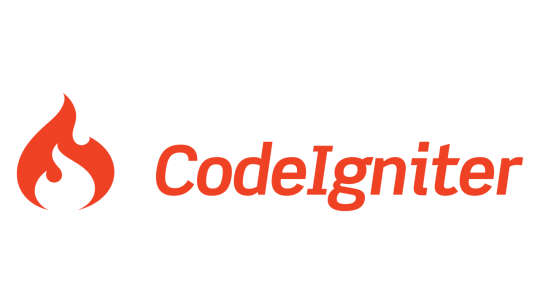
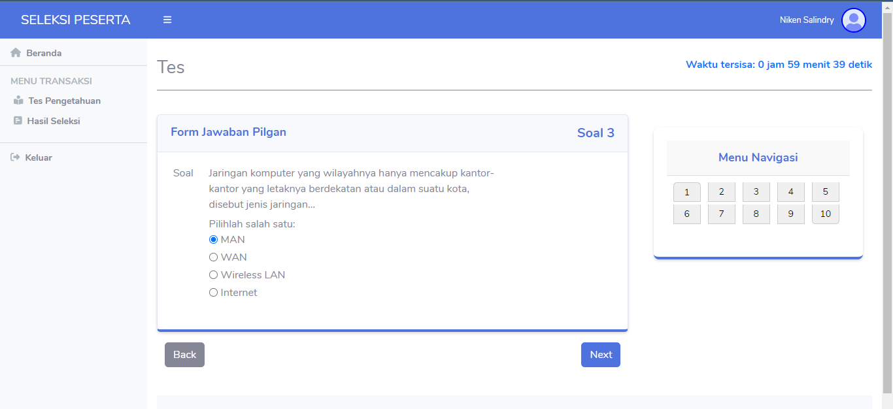
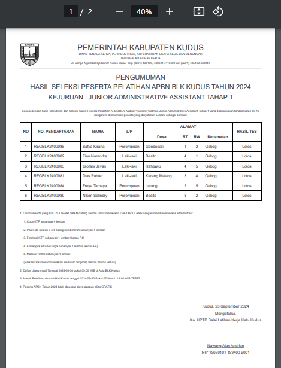

<p align="center">
  <a href="https://codeigniter.com" target="_blank">
    
  </a>
</p>

<p align="center">
  <a href="https://packagist.org/packages/codeigniter4/framework"></a>
  <a href="https://packagist.org/packages/codeigniter4/framework"></a>
  <a href="https://opensource.org/licenses/MIT"></a>
</p>

# 🧮 Sistem Seleksi Peserta Pelatihan Berbasis Web — Metode Hybrid AHP + SAW

**UPTD Balai Latihan Kerja (BLK) Kabupaten Kudus**

> _“Menuju Seleksi Peserta Pelatihan yang Lebih Efisien, Transparan, dan Objektif”_

---

## Deskripsi Singkat

Sistem ini dirancang untuk **meningkatkan efisiensi dan transparansi proses seleksi peserta pelatihan** di **UPTD BLK Kabupaten Kudus**.  
Melalui integrasi metode **Analytical Hierarchy Process (AHP)** dan **Simple Additive Weighting (SAW)**, sistem mampu memberikan hasil seleksi yang **lebih objektif dan akurat** berdasarkan pembobotan kriteria dan pemeringkatan nilai peserta.

Aplikasi ini dikembangkan berbasis **web (CodeIgniter 4)**, menggunakan **database MySQL**, dan dilengkapi dengan **fitur notifikasi email otomatis** untuk penyampaian hasil seleksi administratif dan jadwal tes.

---

## Tujuan Sistem

- Meningkatkan **efisiensi waktu** dan **akurasi seleksi**.
- Menjamin **transparansi proses** melalui sistem terkomputerisasi.
- Menyediakan **pemeringkatan otomatis** berdasarkan bobot kriteria.
- Memudahkan penyampaian hasil seleksi melalui **notifikasi email**.
- Mendukung **pengambilan keputusan berbasis data** dengan metode AHP-SAW.

---

## Metodologi Pengambilan Keputusan

### Metode SAW (Simple Additive Weighting)

Digunakan untuk menghitung nilai akhir peserta berdasarkan bobot kriteria dan hasil penilaian.

### Metode AHP (Analytical Hierarchy Process)

Digunakan untuk menentukan **tingkat kepentingan antar kriteria** secara sistematis melalui perbandingan berpasangan.

### Kombinasi AHP-SAW

AHP digunakan untuk menentukan **bobot kriteria**, sedangkan SAW digunakan untuk **menghitung total skor dan peringkat peserta**.  
Kombinasi ini menghasilkan sistem yang lebih **objektif dan konsisten** dibandingkan metode SAW tunggal.

---

## Fitur Notifikasi Email Otomatis

Sistem mengirimkan email otomatis kepada peserta terkait:

- **Hasil seleksi administratif**
- **Jadwal tes atau wawancara**
- **Pengumuman hasil akhir seleksi**

Email dikirim menggunakan library PHP Mailer dan dikonfigurasi secara manual tanpa file `.env`, agar fleksibel untuk implementasi di lingkungan lokal.

---

## Fitur Aplikasi

- **Login & Manajemen Akun Petugas**
- **Filter Administratif Awal (Syarat Dokumen)**
- **Menu Pengerjaan Tes Pengetahuan**
- **Menu Penilaian Tes Wawancara**
- **Perhitungan Seleksi AHP-SAW Otomatis**
- **Peringkat Peserta Berdasarkan Nilai Akhir**
- **Notifikasi Email Otomatis ke Peserta**
- **Dashboard Statistik Seleksi**
- **Laporan & Cetak Data Seleksi**

---

## 🧩 Teknologi yang Digunakan

| Komponen            | Teknologi                            |
| ------------------- | ------------------------------------ |
| **Framework**       | CodeIgniter 4                        |
| **Backend**         | PHP 7.2+                             |
| **Frontend**        | HTML5, CSS3, Bootstrap 5, JavaScript |
| **Database**        | MySQL                                |
| **Email Service**   | PHP Mailer                           |
| **Version Control** | Git & GitHub                         |

---

## Screenshot Aplikasi

<p align="center">
  
</p>

<p align="center">
  
</p>

<p align="center">
  
</p>

<p align="center">
  
</p>
<p align="center">
  
</p>
---

## Cara Menjalankan Aplikasi

### Clone Repository

```bash
git clone https://github.com/nawangandrian/sistem-seleksi.git
```
